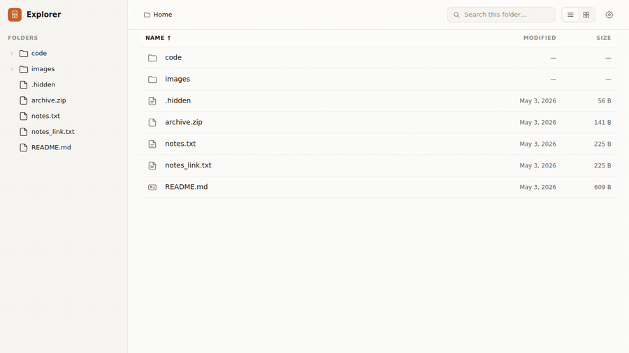
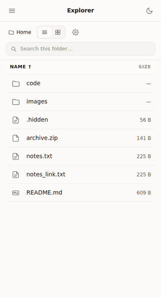

# explorer

[](go.mod)
[](LICENSE)

> ⚠ **Playground / personal use only.** This is a hobby project, not a
> hardened service. There is no authentication, no rate limiting, and no
> security audit. Anyone who can reach the port can read every file
> under the served directory. Run it on your own machine bound to
> loopback (the default), or on a trusted LAN — never expose it to the
> public internet, behind a tunnel, or on a shared host.

A single-binary local directory browser — point it at a folder, open the URL, read everything in place from your phone on the same Wi-Fi.

<p align="center">
  
</p>

<p align="center">
  
</p>

## Why explorer?

Sometimes you just want to read the markdown notes, text files, and images on your laptop from the couch — on a phone, in a browser, without copying anything anywhere. `explorer` is a single static Go binary that serves a chosen directory over HTTP as a read-only browser, with markdown rendering, inline images, and deep-linkable URLs. No accounts, no writes, no cloud.

## Install

### With Go (recommended for users)

Requires Go 1.24+.

```bash
go install github.com/anantadwi13/explorer/cmd/explorer@latest
```

This drops an `explorer` binary in `$GOBIN` (or `$GOPATH/bin` — make sure it is on your `PATH`). Once tagged releases exist, pin a version with `@v0.1.0` instead of `@latest`.

To try it without installing:

```bash
go run github.com/anantadwi13/explorer/cmd/explorer@latest <dir>
```

### From source (for contributors)

Requires Go 1.24+ and Node 18+.

```bash
git clone https://github.com/anantadwi13/explorer.git
cd explorer
make build      # builds the SPA, embeds it, produces ./explorer
./explorer <dir>
```

### Docker / Docker Compose

```bash
docker compose up --build
```

Then open `http://localhost:8080`. The `docker-compose.yml` bind-mounts the current directory into `/data` (read-only) and runs:

```
explorer /data --host 0.0.0.0 --port 8080
```

**`--host 0.0.0.0` is mandatory inside the container.** With the default `127.0.0.1`, the server listens only on the container's loopback interface and Docker's port mapping cannot reach it.

## Quick start

```bash
# Serve the current directory on the default loopback port
explorer .

# Serve /home/alice/docs on port 9000
explorer /home/alice/docs --port 9000

# Expose on all interfaces (LAN-accessible — read the warning below)
explorer . --host 0.0.0.0
```

When `--host` is not a loopback address, the startup banner prints a warning:

```
explorer serving /home/alice/docs
  → http://0.0.0.0:8080   (also reachable on your LAN)
  ⚠ host is not loopback — anyone on this network can read these files.
```

## Configuration

| Flag | Default | Description |
|------|---------|-------------|
| `--port` | `8080` | TCP port to listen on |
| `--host` | `127.0.0.1` | Address to bind to |

## Features

- Serves any local directory over HTTP as a read-only browser
- Embedded React SPA: markdown rendering (GFM), text viewer, inline images, download button for everything else
- Mobile-first responsive layout; desktop shows a persistent tree sidebar
- Deep-linkable URLs for every folder and file
- Light / dark / system theme toggle
- Single static binary — no runtime dependencies

## Security model

`explorer` is designed for trusted, local use:

- **Read-only.** No write, update, or delete endpoints exist. The binary never modifies the served tree.
- **Loopback by default.** `--host` defaults to `127.0.0.1`, so out of the box only your own machine can reach it.
- **Path-traversal containment.** Every path-accepting endpoint resolves the request relative to the served root, rejects `..` and absolute paths, and follows symlinks only if the resolved target stays inside the root. Symlinks pointing outside the root are silently dropped from listings and return `400 outside_root` when accessed directly.
- **No authentication.** There is no login, no token, no per-file ACL.

Because there is no authentication, **`--host 0.0.0.0` exposes every file under the served root to anyone who can reach your machine on the network.** Only do this on a network you trust. Do not expose `explorer` to the public internet.

## Development

Two-process dev workflow: Go server on `:8080` + Vite dev server on `:5173` proxying API/raw paths to the Go server.

```bash
make dev-server       # builds and runs the Go binary against ./testdata
make dev-web          # starts the Vite dev server on :5173 (run alongside dev-server)
make test             # go test ./cmd/... ./internal/...
make web-commit       # rebuild the embedded SPA and stage internal/server/ui/dist/
make clean            # remove ./explorer and internal/server/ui/dist
```

`internal/server/ui/dist/` is committed to source control so module-proxy installs (`go install`, `go run`) ship a working SPA. **Run `make web-commit` whenever you change anything under `web/src/`** so the embedded build stays in sync.

## Out-of-scope (v1)

These are intentionally deferred:

- File watcher / live reload
- Search across files
- Syntax highlighting for code
- README auto-render in folder listings
- Tree pagination per folder
- Authentication / multi-user
- Write / update / delete
- PDF, Office, video, audio preview

## Troubleshooting

**"connection refused" on port 8080 in Docker**

Make sure the `command` in `docker-compose.yml` includes `--host 0.0.0.0`. The default loopback bind is not reachable through Docker's port mapping.

**Binary shows "SPA not yet embedded" or 501 errors after a local build**

Run `make build` (not just `go build`) to ensure the frontend is built and embedded. If you got the binary via `go install ...@latest` and still see this, the published `internal/server/ui/dist/` is empty — please open an issue, this should not happen.

**Symlink file is missing from listing**

Symlinks whose targets resolve outside the served root are silently omitted from directory listings and return a `400 outside_root` error when accessed directly — this is intentional path-traversal containment.

## Contributing

Issues and pull requests are welcome.

- Run `make test` before submitting a PR.
- If your PR touches `web/src/`, run `make web-commit` and include the regenerated `internal/server/ui/dist/` in the same commit. The embedded SPA is shipped via the Go module proxy, so a stale `dist/` means `go install` users get an outdated frontend against an updated API.

## License

[MIT](LICENSE) © anantadwi13
